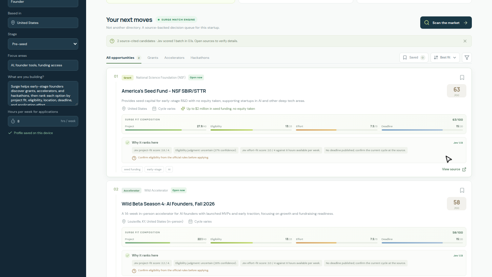

# AWS Builder Center — submission draft

## Project

**Surge — Find the next opportunity worth your time**

**Category:** Commercial Potential  
**Lane:** Startup  
**Tags:** `#commercial-potential` `#startup`

**Challenge:** [AWS Builder Center Zero to Shipped](https://builder.aws.com/build/hackathons/e83e84e5-4f4c-383b-bbe9-4a15ac195d55)

**Deadline:** October 2, 2026, 11:59 p.m. PT

**Live demo:** https://surge.arcumet.com

**Recorded walkthrough:** [31-second time-compressed live demo](docs/surge-demo.mp4)

## Short description

Surge is the founder-fit decision engine for the global opportunity market. It searches grants, accelerators, and hackathons, then aligns each candidate to a startup's project, eligibility, location, deadline, and application capacity. Every rank has an official source and a clear reason.

## Elevator pitch

A founder's next grant, accelerator, or hackathon should not be buried in a thousand tabs. Surge turns a startup profile into a source-backed action queue: Jev scores fit, eligibility, and application effort in structured batches; Surge adds deadline runway, explains every rank, and animates the best next moves into focus. We are building the decision engine founders use to spend application hours where they have the strongest shot.

## Full project story

Opportunity directories answer what exists. Surge answers the more valuable question: what should this startup pursue next?

A founder profile becomes the scoring lens. Surge discovers candidate grants, accelerators, and hackathons from official sources. Jev evaluates project fit, eligibility, and application effort with structured choices and scores; Surge adds deterministic deadline runway and produces a source-backed action queue. The throughput unlock is the format: compact typed decisions, batched across candidates—not a long generated memo for each link. No generic summary, no untraceable score—each opportunity comes with the evidence and the reason it ranks where it does.

The scale thesis is simple: a founder should not have to open thousands of program pages one by one. Surge is designed to batch-rank a much larger global catalog; Jev decisions run in 20-record batches, while the live demo proves the cited-discovery-to-ranked-action loop. The current web scan returns up to 30 verified candidates per pass, and we will publish throughput claims only after measuring the larger catalog.

Surge is being built for the AWS Builder Center Zero to Shipped challenge itself. The product is the founder-fit decision engine; Jev is the new structured scoring capability under the hood—not the thing we are asking founders to buy.

## 31-second demo outline

1. Start with the founder profile and show Surge scanning the live market.
2. Reveal the signal map: opportunity mix, Jev fit distribution, and deadline runway.
3. Watch the shortlist reorder; open one result to show its score composition, explanation, and official source.
4. Save the strongest move and show the founder-specific pipeline.

## Development process

Codex CLI helped shape the product, implement and test the Next.js app, and deploy it to EC2 using the machine's configured AWS CLI credentials. The agent inspected the existing instance and network rules, configured a restartable service and Nginx HTTPS proxy, then verified the live public URL.

## Technical notes

- Next.js app deployed on an AWS EC2 instance; Nginx terminates HTTPS and proxies to a systemd-managed Next.js service.
- OpenRouter web search supplies current opportunity research; the app accepts only matching URL-citation annotations and checks that the cited hostname plausibly belongs to the named organizer.
- Jev 1.13 provides typed eligibility `choice` and project/effort `score` judgments. Surge dispatches candidates in 20-record batches, supports up to 1,000 records per rank request, limits concurrency to four, and returns measured batch count and latency. Deadline points are calculated in application code.
- Public discovery and ranking endpoints have per-client and daily budgets to cap OpenRouter spend during the demo.
- Live discovery currently checks grants, accelerators, and hackathons separately and returns up to 30 citation-verified candidates per scan; expanding the maintained source catalog is the path to the full thousands-scale vision.
- Request payloads are length-clamped server-side before reaching paid model calls, and known third-party directories or social sites are rejected as "official" sources.
- OpenRouter credentials remain server-side in an ignored, mode-600 runtime file. The browser never receives the key.
- Demo/reference rows are labelled, and current-cycle details must be verified at the linked source.

