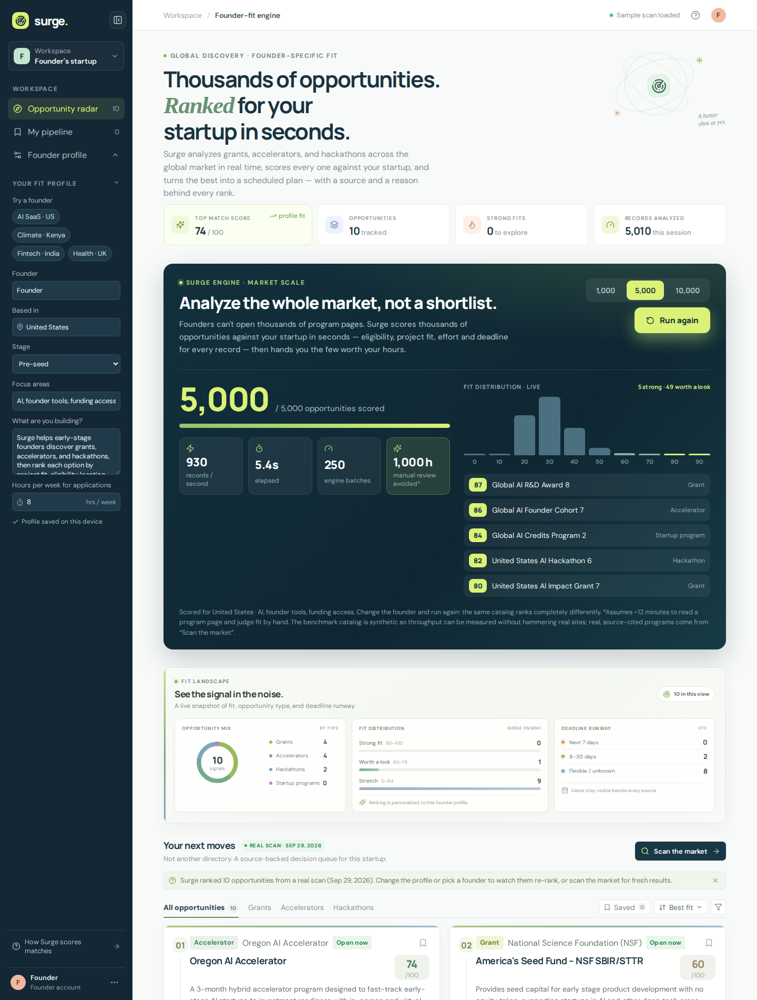
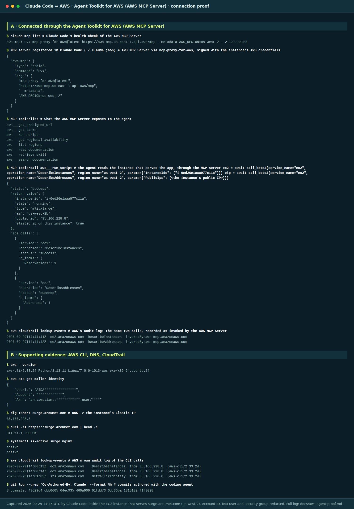

# AWS Builder Center — submission

## Project

**Surge — Democratizing opportunity with System 1 decision models**

**Category:** Commercial Potential  
**Lane:** Startup  
**Tags:** `#commercial-potential` `#startup`

**Challenge:** [AWS Builder Center Zero to Shipped](https://builder.aws.com/build/hackathons/e83e84e5-4f4c-383b-bbe9-4a15ac195d55)  
**Live app:** https://surge.arcumet.com (public URL, AWS EC2 · us-west-2)  
**Coding agent:** Claude Code (Anthropic, Sonnet 5.5) — connected to AWS through the **Agent Toolkit for AWS (AWS MCP Server)**, [proof below](#proof-the-coding-agent-is-connected-to-aws)  
**Recorded walkthrough:** [67-second narrated demo](docs/surge-demo.mp4)

## Elevator pitch

Whether a founder finds the right grant, accelerator or hackathon shouldn't depend on who they know. Surge uses **System 1 decision models** — a new class of model, released in September 2026, that returns fast, calibrated judgments instead of paragraphs — to score 10,000 programs against any startup in about nine seconds, for roughly 57 cents. Every rank carries a reason and an official source, and the best fits become a four-week plan built around the hours the founder actually has.

## Why System 1 decision models change who gets opportunity

Matching a founder to the market is not a writing problem. It is thousands of small judgments — *am I eligible? does this fit my project? can I afford the hours?* General-purpose LLMs answer such questions the System 2 way: they deliberate in prose, token by token, which is slow, costly and hard to compare across records, so people use them on a shortlist or not at all. A **decision model** does the opposite. Introduced in September 2026, it is trained to read a situation and return a typed, calibrated answer — a choice with probabilities, or a score on a scale you define — with no prose in between. That flips the economics. In our benchmark, Surge scored 10,000 records in under ten seconds for about $0.57, which makes it affordable to score a whole catalog against *every* founder and offer it free. The edge in this market has always gone to founders with an advisor, an accelerator network, or spare hours to read thousands of pages; a solo founder in Nairobi can now get the same exhaustive first pass. We keep the speed honest with code: deadlines, the 100-point score composition and the schedule are deterministic, and every discovered program must cite its official page, so fast never means unaccountable.

## Meet Amara

*Amara is a composite of the founders Surge is built for — illustrative, not a real customer.*

Amara is building solar-powered cold storage for smallholder farmers near Nairobi. She has **eight hours a week** that are not the product.

Somewhere in a market of thousands of grants, accelerators and hackathons is the program that fits a Kenyan cold-storage startup. Around it sit dozens that look the same and are closed to her — wrong country, wrong stage, wrong focus. Every wrong guess costs her a week she doesn't have. Directories list what exists; none of them tell her what to do *this week*. So she guesses, and the founders outside the big hubs guess worst.

Amara describes her company to Surge once. In about nine seconds it scores 10,000 opportunities against her — eligibility, project fit, effort and deadline for every one — and the field rearranges around her. A three-day climate hackathon in Nairobi jumps to **80/100**. A Mott Foundation program for smallholder farmers lands at **72**, flagged *"eligibility uncertain — confirm before applying."* A UNDP GreenTech launchpad scores **68**. Each rank shows how its 100 points were earned and links to the organizer's own page.

Then Surge does what a directory never does: it fits the best of them into her eight hours a week and hands her a **four-week application plan**.

A fintech founder in Bengaluru opens the same market and sees a completely different top of the list. That is the point: **same market, different decisions.**

## Measured on the live deployment

**Speed**

| Test | Result |
| --- | --- |
| 10,000 records scored | ≈ 9 s (≈ 1,000 records/s), 500 engine batches |
| 1,000 records in a single API call | 3.6 s, 50 batches |
| Model cost | ≈ $0.57 per 10,000 records (≈ $0.00006 per record), read from the provider's usage meter |
| Hand-review equivalent (assumes 12 min per record) | ≈ 2,000 hours |

**Personalization** — for each founder we scored the same 10,000 records and inspected the top 50:

| Founder | Top 50 in the right region | Top 50 in the right sector | Both (vs. 1–2% of the catalog) |
| --- | --- | --- | --- |
| Climate · Kenya | 100% | 100% | 100% (49× lift) |
| Fintech · India | 100% | 86% | 86% (104× lift) |
| Health · UK | 98% | 80% | 78% (78× lift) |
| AI SaaS · US | 98% | 100% | 98% (103× lift) |

The founders' top-50 lists overlap by **0–6%**: the engine is not returning one generic list.

*Honest limits:* the benchmark catalog is **synthetic and labelled** so throughput and personalization can be measured without hammering real program websites; in it, region and sector are explicit fields, so this shows the engine honours a founder's constraints — not that it judges every real program correctly. Real, source-cited programs come from the live scan and from the dated real sample scan (Sep 29, 2026) that loads on first visit. Benchmark records are never presented as real programs.

## What is technically new

- **System 1 decision model, not a chatbot.** Surge's engine is a decision model: it returns typed answers, never prose. Eligibility is a three-way choice with probabilities; project fit and application effort are five-level scored rubrics. Compact typed answers are comparable across records and batchable, which is what makes ~1,000 records/second possible.
- **The model judges; code owns the arithmetic.** The engine decides what needs judgment (fit, eligibility, effort). Deterministic code owns what must be exact — deadline runway, the 100-point composition, and scheduling — so every point is attributable and nothing is a black-box number.
- **Citation-gated discovery.** A live scan is accepted only if the cited page matches and its host plausibly belongs to the named organizer; third-party directories and social sites are rejected as "official" sources. Unknown dates and effort are shown as unknown, never guessed.
- **Ranking becomes action.** A scheduler places the best fits into the founder's real weekly hours in deadline order, splits work that spans weeks, and states what it left out and why.
- **Built to be safe in public.** Per-client and daily budgets, server-side payload clamping, a six-hour scan cache, and credentials that never reach the browser.

## Community and market impact

**The scale of the problem, in Amara's terms.** Hand-reviewing 10,000 programs at ~12 minutes each is ≈ 2,000 hours. At Amara's eight hours a week, that is **about five years** — so she never does it, and the best-fit program stays invisible. Surge does it in nine seconds and gives her back the hours to *apply*.

- **Who it helps first:** early-stage founders with little spare time and thin networks — the ones for whom one misdirected application is the most expensive. Eligibility and location are first-class inputs, so value is highest exactly where discovery is hardest: outside the hubs where opportunities already find you.
- **Business model:** free to try; a Pro tier for continuous monitoring, deadline alerts and calendar sync (calendar and CSV export already ship). Accelerators, funders and ecosystems want *qualified* applicants, so the same engine becomes a sponsored routing layer on the program side — the party with budget pays to reach founders who actually fit.
- **Moat:** a maintained, verified catalog plus outcome data on which founders got in — something no static directory collects.
- **What success looks like:** applications submitted per founder-hour, share of applications sent to programs the founder was eligible for, and acceptance rate. We instrument these first.
- **Next 30 days:** onboard a first cohort of founders through two or three startup ecosystems, replace the sample catalog with a continuously refreshed verified one, and add deadline alerts.

Surge is live and public today on AWS; the measurements above are its proof points, and the founder cohort is the next milestone.

## Architecture

- **Next.js on AWS EC2**, Nginx terminating HTTPS in front of a systemd-managed service; `npm run deploy` lints, builds, restarts and verifies the live page.
- **Surge Engine** — a System 1 decision model (TypeSafe AI's Jev, released September 2026) served through OpenRouter. We did not train it; Surge's contribution is the product around it: batching, the deterministic score composition, citation-gated discovery and the planner. Records are scored in 20-record batches, four in parallel; each request accepts up to 1,000 records, and the UI streams larger runs as concurrent chunks. Deadline runway is deterministic code, not a model guess.
- **Live discovery** uses OpenRouter web search, gated by the citation checks above.

## Development process

**Agent:** Claude Code (Anthropic, Sonnet 5.5), running inside the same AWS EC2 instance that serves the app and using its configured AWS CLI credentials.

**How the agent helped me ship** — it did the work, and every step was checked against the live site:

1. **Inspected AWS before touching it** — through the AWS MCP Server and the AWS CLI: the running instance, its Elastic IP and security-group rules, plus a DNS check that `surge.arcumet.com` resolves to that IP.
2. **Operated the deployment.** A restartable systemd service behind Nginx HTTPS (with an HTTP→HTTPS redirect), then `npm run deploy`, which lints, type-checks, builds, restarts the service and verifies the live page and its CSS return 200.
3. **Measured before claiming.** It benchmarked the deployed API (10,000 records in ≈ 9 s; 1,000 in one call in 3.6 s) and found and fixed its own rate-limit and truncation mistakes along the way.
4. **Hardened it.** Server-side payload clamping, a rejection list for third-party directories posing as official sources, per-client and daily budgets, a six-hour scan cache.
5. **Built and verified the product.** Scale engine, founder personas with live re-ranking, the four-week planner, collapsible sidebar and larger type, and the narrated demo — each checked with automated browser tests against the live URL, including a mobile-overflow bug it caught and fixed.
6. **Kept the record honest.** Benchmark data is labelled synthetic; the sample scan is dated; the README, this page and the demo were updated to match what is really deployed.

## AWS services and coding agent used

| Service | How Surge uses it |
| --- | --- |
| **Amazon EC2** (m7i.xlarge, us-west-2b) | Runs the Next.js app (a systemd service) and Nginx; serves the public URL |
| **Elastic IP** | Stable public address that `surge.arcumet.com` resolves to |
| **Amazon EBS** (gp3) | Root volume for the instance |
| **Amazon VPC security groups** | Public HTTP/HTTPS ingress to the instance |
| **AWS IAM** | Credentials the agent uses, and permission to call the AWS MCP Server |
| **AWS MCP Server** (Agent Toolkit for AWS) | The connection between the coding agent and AWS |
| **AWS CloudTrail** | AWS's own audit log of the agent's API calls |

*Not AWS, stated plainly:* DNS is Cloudflare (DNS-only, not proxied), the TLS certificate is Let's Encrypt, and the Surge Engine and live web search are reached through OpenRouter.

**Coding agent:** Claude Code, connected to AWS through the **Agent Toolkit for AWS**: the AWS MCP Server is registered with Claude Code using the `mcp-proxy-for-aws` SigV4 route, which signs requests with the instance's AWS credentials. The agent used that connection to read the instance that serves the app.

## Proof: the coding agent is connected to AWS

**A — the connection itself.** Claude Code's health check reports `aws-mcp … ✔ Connected`; the agent then called `DescribeInstances` and `DescribeAddresses` through the AWS MCP Server, and both returned `success`. **AWS CloudTrail independently logged those two calls as `invokedBy=aws-mcp.amazonaws.com`.** The instance it read (`i-0ed26e1aaa977c11a`, us-west-2, `35.166.228.8`, Elastic IP attached) is the one `surge.arcumet.com` resolves to, and the site returns `HTTP 200` from it.

**B — supporting evidence.** The AWS CLI authenticates (`sts get-caller-identity`); **CloudTrail also recorded the agent's CLI calls** from the instance's own IP; and every commit made with the agent carries a `Co-Authored-By: Claude` trailer, listed by hash. Account ID, IAM user and security group are redacted; the full log is in [`docs/aws-agent-proof.md`](docs/aws-agent-proof.md).

## Demo outline (67 seconds, narrated)

1. **Hook (0–6s)** — 10,000 opportunities scored for the startup live, counter racing from 0 to 10,000 in about nine seconds.
2. **The problem** — founders don't lack opportunities, they lack the time to find the right ones.
3. **Surge, ranked for you** — real, source-cited opportunities already ranked for the default founder.
4. **How it scores** — every record on eligibility, project fit, effort and deadline; ≈ 2,000 hours of reading avoided.
5. **Change the founder** — Fintech · India gets a completely different top five from the same market.
6. **The grid re-ranks live** — `▲/▼` chips show how far each card moved (e.g. `▲9 · +57`).
7. **Live scan** — Surge searches official organizer pages and keeps only citation-verified sources.
8. **From ranking to action** — a four-week plan scheduled around the founder's real weekly hours.
9. **Close** — Surge. Stop searching. Start applying. Live on AWS.
